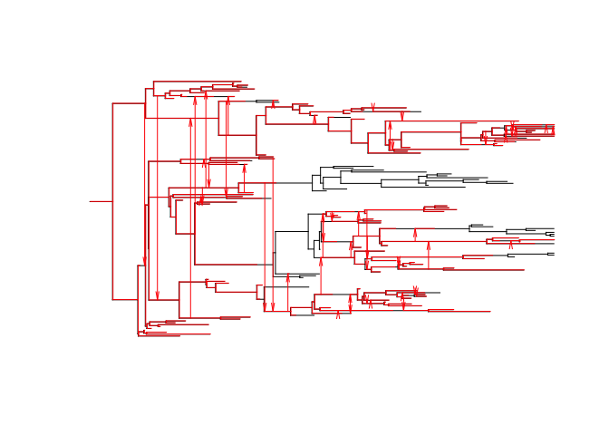

<!-- README.md is generated from README.Rmd. Please edit that file -->
cophy
=====

The aim of cophy is to generate, analyse and plot cophylogenies. By this we mean a phylogenetic tree of species ("hosts"), combined with another phylogenetic tree of species ("parasites"). Each branch of the parasite tree is linked to one particular host branch. Random generation of cophylogenies involves a number of evolutionary events, including host speciation and extinction, parasite host shifts (potentially with a preference for closely related hosts), parasite extinction, and others.

Example
-------

Here is a simple example for how you can create a random cophylogeny, and plot it:

``` r

library(cophy)
set.seed(7)
cop<-rcophylo_HP(tmax=20, K=30, beta = 2, gamma = 0.3, nu = 0.3)
cop
#> Cophylogeny consisting of a host tree and an associated parasite tree.
#> Host tree:
#> Phylogenetic tree with 136 tips and 135 internal nodes.
#> 
#> Tip labels:
#>  t1, t2, t3, t4, t5, t6, ...
#> 
#> Rooted; includes branch lengths.
#> 
#> Parasite tree:
#> Phylogenetic tree with 152 tips and 151 internal nodes.
#> 
#> Tip labels:
#>  t1, t2, t3, t4, t5, t6, ...
#> 
#> Rooted; includes branch lengths.
get_infectionStatistics(cop)
#>         noHspecies         noPspecies   fractionInfected 
#>         13.0000000          6.0000000          0.4615385 
#> meanInfectionLevel 
#>          0.4615385
plot(cop)
```



Installation
------------

To install cophy, you first need to install and load the devtools package (available on CRAN). Then, run the following line of code:

``` r
devtools::install_github("JanEngelstaedter/cophy")
#> Downloading GitHub repo JanEngelstaedter/cophy@master
#> from URL https://api.github.com/repos/JanEngelstaedter/cophy/zipball/master
#> Installing cophy
#> '/Library/Frameworks/R.framework/Resources/bin/R' --no-site-file  \
#>   --no-environ --no-save --no-restore --quiet CMD INSTALL  \
#>   '/private/var/folders/8z/mqp724ld2n1c6krws_2pqvdh0000gn/T/RtmpM43Bj6/devtoolsc62396da9c/JanEngelstaedter-cophy-d9083ef'  \
#>   --library='/Library/Frameworks/R.framework/Versions/3.5/Resources/library'  \
#>   --install-tests
#> 
#> Reloading installed cophy
```
